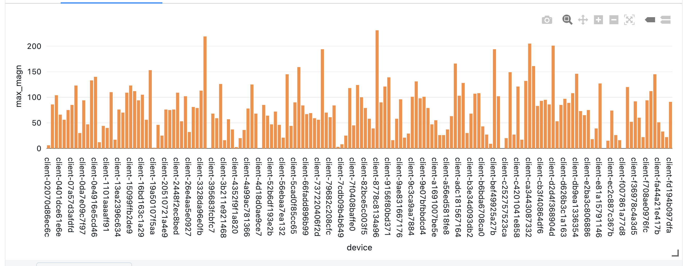

# motion
Distributed Seismograph. DAIS 2023 demo to analyze IoT events from more than 130 mobile phone accelerometers in a streaming data pipeline.
**Note that this is not a canned demo**. To enjoy it, you have to be able to provision a Kinesis stream, a publicly accessible S3 bucket, and an AWS Inkognito pool. 

## Background Story

In this live demo from [DAIS 2023](https://www.databricks.com/dataaisummit/session/embracing-future-data-engineering-serverless-real-time-lakehouse-action/). In the demo I show how to use serverless Databricks Delta Live Tables (DLT), Workflows, SQL for data ingestion, cleansing, and transformation. Even with the smallish demo setup, I could process 51 million events per day.

## Architecture 

You can get this [Excalidraw architecture diagram from here](motion.excalidraw). 

## Notebooks 📔 

* `M-DataPipeline DLT`: Streaming data pipeline with DLT, reading data from AWS Kinesis
* `M-Histo`: Streaming histogram over client-id and max(magn)
* `M-Magn SSS`: Streaming real-time data analytics with Spark Structured Streaming
* `M-Heatmap`: Plotly heat map used from Workflow
* `M-Plot`: 3D plot with Plotly
* `DeltaSharing_DAIS2023`: Google Colab Notebook for Delta Sharing
* `M-Plot`: 3D plot with Plotly

## Setup

### DBR Version
Workflows and SQL are serverless. For SSS DBR 13.1 is used.
## How to Run the Demo 🚀 ?
### 🐑 Clone the Repo
Use [Databricks Repos](https://docs.databricks.com/repos/index.html#clone-a-remote-git-repository) from your Databricks workspace to clone the repo and kick off the demo. The repo consists of the notebooks listed above. The workflow definition and the serverless SPA is not part of the repo.

### 🚀 Running the demo 
* Set up a Kinesis stream and note the ARN. 
* Create an AWS identity pool with Incognito for the SPA (magn.html). Allow kinesis put operations with the ARN from above for everyone. 
* Edit the SPA and replace the Kinesis stream name and the Incognito pool ID. 
* Place the SPA in an S3 bucket and make it publicly accessible. Make sure you can access it from a mobile device. 
* Run DLT pipeline in continuous mode.
* Run the notebooks for the client ID histogram and in another tab the streaming data analytics notebook for the averaged max live display.

### Results

When running this demo at DAIS, some attendees achieved a magnitude of over 200 (on a non-calibrated scale). 

I used Delta Sharing (see notebook above) to read these results with a Colab notebook. 

### Not running this demo

If you feel less experimental, we also provide a lot of canned demos that can be run with a simple `pip install` or even without a Databricks account in the [Databricks Demo Center](https://databricks.com/demos) 

## Resources

### 🤝 Feedback and contributing

* Blog: [Low Latency Streaming Data Pipelines with Kafka and DLT](https://www.databricks.com/blog/2022/08/09/low-latency-streaming-data-pipelines-with-delta-live-tables-and-apache-kafka.html)
* This demo is provided "as is". Please join the [Databricks Community Forum](https://community.databricks.com/) for technical questions and discussions
* Follow me on twitter for more Data and AI: [@frankmunz](https://twitter.com/frankmunz). 

